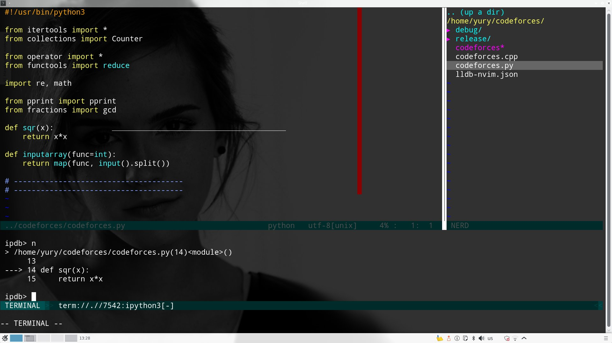
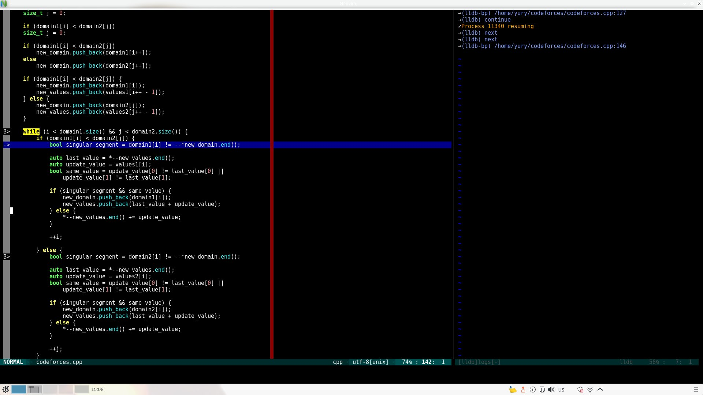
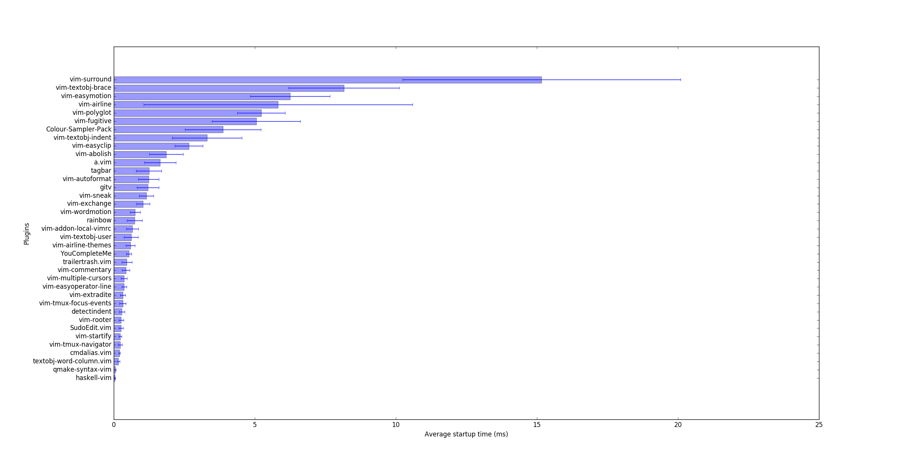

# The Ultimate vimrc

My .nvimrc (but  should still be vim compatible) configuration  file. I use vim
for python (usually python3), c++, html, css, JavaScript and LaTeX programming.

## Table of Contents

  * [The Ultimate vimrc](#the-ultimate-vimrc)
    * [Table of Contents](#table-of-contents)
    * [Installation](#installation)
    * [Neovim](#neovim)
    * [Windows](#windows)
    * [Startup time](#startup-time)
    * [Mappings and commands](#mappings-and-commands)
      * [File system navigation](#file-system-navigation)
      * [Tabs, windows, buffers](#tabs-windows-buffers)
      * [Visual mode](#visual-mode)
      * [Quick scripting](#quick-scripting)
      * [Code navigation](#code-navigation)
      * [Commenting](#commenting)
      * [Spell checking](#spell-checking)
      * [Miscelaneous](#miscelaneous)
    * [Installed plugins](#installed-plugins)

## Installation

    sudo apt-get update
    sudo apt-get install build-essential python-dev cmake git libboost-all-dev
    git clone --depth=1 https://github.com/Bellaktris/vimrc.git ~/.ultimate-vim

    sudo apt-get install mono-complete gocode exuberant-ctags clang
    sudo apt-get install nodejs npm libclang-dev silversearcher-ag enca par
    sudo python3 ~/.ultimate-vim/packages.py

    python3 ~/.ultimate-vim/configs.py

Change apt-get to your package manager or compile from sources.

## Neovim

Neovim is a  vim fork that seeks  to aggressively refactor Vim.  Right now, you
can get true  color support, pure control key mapping  (ctrl, alt, meta, etc.),
and  embedded terminal  multiplexing. You  can also  use asynchrounous  plugins
based  on neovim  asynchronous  API. In  ubuntu you  can  install neovim  using
apt-get:

    sudo add-apt-repository ppa:neovim-ppa/unstable
    sudo apt-get update
    sudo apt-get install neovim

    sudo update-alternatives --install /usr/bin/vi vi /usr/bin/nvim 60
    sudo update-alternatives --config vi
    sudo update-alternatives --install /usr/bin/vim vim /usr/bin/nvim 60
    sudo update-alternatives --config vim
    sudo update-alternatives --install /usr/bin/editor editor /usr/bin/nvim 60
    sudo update-alternatives --config editor

## Windows

Windows support is broken now, but you can still try.

## Startup time

Plugins are  loaded on  demand, so  you should not  feel any  significant delay
comparing to the raw vim installation.

## Mappings and commands

You will have many  benefits just on the fly, but there are  some that you need
to know about. Though, the actual vim way is, of course, configuring everything
for your specific needs.

### File system navigation

    <leader>cp (normal mode)
        open fzf windows (best for switching files of one single project)
    <leader>nt (normal mode)
        toggle right-side file navigation panel
    <leader>cd (normal mode)
        change current dir to the dir of the file edited
    <leader>te (normal mode)
        print :tabedit <path to current file>

    <leader>ag (normal mode)
        print ":Ag" , Ag is grep for code searching,
    <leader>gv (visual mode)
        print :Ag <selection>

### Tabs, windows, buffers

    Ctrl-j, Ctrl-k, Ctrl-l, Ctrl-h (normal or insert modes)
        common mapping for moves between windows

### Visual mode

    Ctrl-n, Ctrl-p, Ctrl-x (normal or visual modes)
        add virtual cursor for the word under cursor, delete virtual cursor,
        or skip virtual cursor

### Quick scripting

    :stdin
        open default stdin file in a new tab
    :stdin filename
        open filename in a new tab and redirect stdin
    :release
        switch C++ compile mode to release
    :debug
        switch C++ compile mode to debug
    :ccargs
        open default cc or cpp compiler flags

    :stdargs
        open default args file
    :stdargs filename
        open filename in a new tab and redirect args
    :async
        toggle synchrounous/asynchrounous building

    :A
        switch code/header

    <leader>xx (normal mode)
        run script (or single cpp file) in the current buffer
        (may require shebang) using stdin file and command line
        arguments from stdargs and show its output in a separate window

### Code navigation

    <leader>tb (normal mode)
        toggle right-side current-file tags navigation panel

### Code editing
    crc<u,s,m,c>
        change the word under cursor to upper, snake, mixed or camel cases

### Spell checking

    <leader>ss (normal mode)
        turn on spell checking
    <leader>sn (normal mode)
        next spell error
    <leader>sp (normal mode)
        previous spell error
    <leader>sa (normal mode)
        append word under cursor to spell dictionary

### Motions and modificators
    i (normal or visual mode)
        same and lower indent modifier
    I (normal or visual mode)
        same indent modifier
    j (normal or visual mode)
        closest braces modifier
    s (normal or visual mode)
        substitute over the followind modificator
    s (normal or visual mode)
        surround modificator
    ga<'=',':','|','&','.',',',' '>
        aligning around chosen character (also works in visual mode as a command)
    <leader>l
        range of lines modifier

### Editing
    <leader>va (normal mode)
        select all
    Shift-d (normal mode)
        split current line on the cursor position
    Ctrl-y (insert mode)
        paste

### Appearance

    <leader>za (normal mode)
        toggle foldenable

    <leader>cc (normal mode)
        toggle colorcolumn

### Miscelaneous
    :w!
        write with sudo

    *, # (normal mode)
        highlight word under cursor

    Shift-s<''', '"', '<', '(', '[', '{', ')', ']', '}', '>'> (visual mode)
        wrap selection with open bracket, quote or tag that follow Shift-s

    <leader>sh (normal mode, neovim only)
        open shell right panel
    <leader>ip (normal mode, neovim only)
        open /bin/ptipython right panel

## Installed plugins

* **Plug** (fast plugin manager)
* **Repeat** (dot repetition for multiple complex actions)
* **Textobj-user** (allow simple definition of vim text objects)
* **Textobj-indent** (indent text objects)
* **Textobj-brace** (any brace text objects)
* **Vim-wordmotion** (allow word separation with underscores and capital letters)
* **Easy Motion** (allow motions like with chrome vim extension, but not mapped)
* **Easy-operator line** (text object for line selection)
* **Sneak** (enhanced f-search)
* **Easyclip** (paste without yanking and substitute action)
* **Cmdalias** (command abbreviations do not affect search mode)
* **ViewDoc** (better help pages)
* **Dispatch** (asynchronous make)
* **YouCompleteMe** (just beautiful autocompletion)
* **Jedi-vim** (python autocompletion, I only use function signature helper)
* **YCM generator** (generates project specific configuration for YouCompleteMe)
* **Startify** (nice-looking welcome screen with most recently used files)
* **Colour-sampler-pack** (color scheme pack)
* **Css-color** (color definition highliting)
* **Vim-polyglot** (colors for almost every language)
* **JavaScript-libraries** (syntax highlighting for JavaScript libraries)
* **Qmake-syntax** (syntax highlighting for qmake project files)
* **Google** (google c++ code style settings)
* **Airline** (nice-looking bottom line)
* **Bexec** (fast script execution)
* **Nerdtree** (file navigation panel)
* **Nerdtree-git-plugin** (git status marks)
* **Tagbar** (panel for navigation over single code file)
* **Grepper** (search for the string inside git repository or just current directory)
* **Fzf** (fuzzy file searcher inside git repository or just current directory)
* **A** (code/header switcher)
* **Fugitive** (vim git interface)
* **Gitv** (vim gitv interface)
* **Vimtex** (latex related settings and commands)
* **Multiple-cursors** (vim implementation of sublime text multiple cursors)
* **Surround** (surround text object)
* **Easy Align** (aligning around charater or regular expression)
* **Commentary** (comment action)
* **Abolish** (morfology aware substituions and converting between variable under cursor name styles)
* **Ultisnips** (powerful shortcuts for common code pieces)
* **Syntastic** (on the fly static analysis)
* **SudoEdit** (allow read and write files with protecting permissions)
* **TrailerTrash** (highlight and remove on save unwanted trailing spaces)
* **Autoformat** (autoformat file command)
* **Local vimrc** (allow per project vimrc files)
